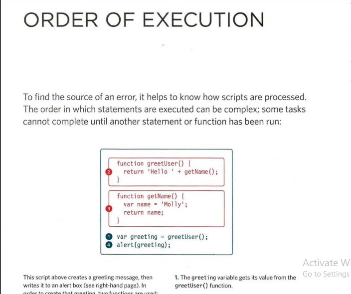

* To find the source of an error, it helps to know how scripts are processed.The order in which statements are executed can be complex; some tasks cannot complete until another statement or function has been run:

The JavaScript interpreter uses the concept of execution contexts.
There is one global execution context; plus, each function creates a new
new execution context. They correspond to variable scope. 

# EXECUT.ION CONTEXTS:
The JavaScript interpreter uses the concept of execution contexts.There is one global execution context; plus, each function creates a new new execution context. They correspond to variable scope. 

* Every statement in a script lives in one of three execution contexts:
1. GLOBAL CONTEXT:Code that is in the script, but not in a function.There is only one global context in any page.
2. FUNCTION CONTEXT:Code that is being run within a function.Each function has its own function context.  
3. EVAL CONTEXT (NOT SHOWN):Text is executed like code in an internal functioncalled eva l {) (which is not covered in this book).  

* VARIABLE SCOPE:The first two execution contexts correspond with the notion of scope.
* GLOBAL SCOPE:If a variable is declared outside a function, it can be used anywhere because it has global scope. If you do not use the var keyword when creating a variable, it is placed in global scope. 

* FUNCTION-LEVEL SCOPE:When a variable is declared within a function,it can only be used within that function. This is
because it has function-level scope.

# EXECUTION CONTEXT& HOISTING :
1. PREPARE:
* The new scope is created
* Variables, functions, and arguments are created
* The value of the this keyword is determined  

2. EXECUTE :
 * Now it can assign values to variables
* Reference functions and run their code
* Execute statements 

# UNDERSTANDING SCOPE
* In the interpreter, each execution context has its own va ri ables object.It holds the variables, functions, and parameters available within it.Each execution context can also access its parent's v a ri ables object.

# UNDERSTANDING ERRORS:
If a JavaScript statement generates an error, then it throws an exception.At that point, the interpreter stops and looks for exception-handl ing code. 

# ERROR OBJECTS 
Error objects can help you find where your mistakes are and browsers have tools to help you read them. 

* ERROR OBJECTS CONTI NUED:
* SYNTAX IS NOT CORRECTThis is caused by incorrect use of the rules of the language. It is often the result of a simple typo. 
* Ref erenceError VARIABLE DOES NOT EXIST This is caused by a variable that is not declared or is out of scope. 

1. DEBUG THE SCRIPT TO FIX ERRORS If you come across an error while writing a script (or when someone reports a bug), you will need todebug the code, track down the source of the error,and fix it. 
2. HANDLE ERRORS GRACEFULLY You can handle errors gracefully using try, catch,throw, and f i na 1 ly statements. 

1. TRY :First, you specify the code that you think might throw an exception within the try block
2. CATCH:If the try code block throws an exception, catch steps in with an alternative set of code
3. FI NALLY: The contents of the fi na 11 ycode block will run either way - whether the try block succeeded or failed. 

JavaScript has 7 different types of errors. Each creates its own error object, which can tell you its line number and gives a description of the error. 
